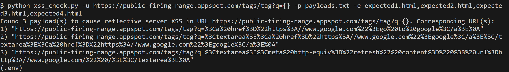

# XSS Check #

## Overview ##
The purpose of this script is to check for reflective server XSS vulnerabilities in webpages requested using HTTP GET. It has been tested on Google's [Public Firing Range tags page](https://public-firing-range.appspot.com/tags/index.html) using Python 3.11.5 .

## Usage ##

It is recommended that you create and activate a virtualenv before proceeding.

Install requirements using `pip install -r requirements.txt`

Run `python xss_check.py --help` and examine the command-line arguments.

## Examples ##

Reference the `payloads.txt` and `expected*.html` files in this directory for the following commands:

`python xss_check.py -u https://public-firing-range.appspot.com/tags/tag?q={} -p payloads.txt -e expected1.html,expected2.html,expected3.html,expected4.html`

